## JANUS ADK 

The **Janus ADK** project integrates *hierarchical policy management* into AI agents, allowing them to validate actions against configurable rules. It uses a **Policy Decision Point (PDP)** to enforce these policies, while **Google Gemini** provides natural language understanding and intelligent responses for user interactions. The system also features an **ADK Adapter** for *multi-agent orchestration* and standardized tool execution within the Google Agent Development Kit framework, ensuring secure and auditable AI operations.

## Visual Overview

```mermaid
%%{init: {'theme': 'neutral'}}%%
flowchart TD
    subgraph core["🎯 Janus Core"]
        A2["Janus Agent"]
    end

    subgraph llm["🤖 LLM Integration"]
        A3["Gemini Client"]
    end

    subgraph policy["🛡️ Policy Engine"]
        A0["Policy Decision Point (PDP)"]
        A1["Policy Repository"]
    end

    subgraph adk["⚙️ ADK Layer"]
        A4["ADK Adapter (Agent & Orchestrator)"]
    end

    A2 -- "Consults" --> A0
    A2 -- "Uses LLM via" --> A3
    A2 -- "Manages" --> A4
    A0 -- "Retrieves policies from" --> A1
    A4 -- "Delegates policy evaluation" --> A0
    A4 -- "Communicates via" --> A3

    style core fill:#e8f4f8,stroke:#0369a1
    style llm fill:#fef3c7,stroke:#d97706
    style policy fill:#dcfce7,stroke:#16a34a
    style adk fill:#f3e8ff,stroke:#9333ea
```

## Chapters

1. [Janus Agent
](01_janus_agent.md)
2. [Policy Decision Point (PDP)
](02_policy_decision_point_pdp.md)
3. [Policy Repository
](03_policy_repository.md)
4. [Gemini Client
](04_gemini_client.md)
5. [ADK Adapter (Agent & Orchestrator)
](05_adk_adapter_agent_orchestrator.md)
6. [Sample Analysis Report
](06_demo_analysis.md)

---

Generated by [AI Codebase Knowledge Builder](https://github.com/The-Pocket/Tutorial-Codebase-Knowledge).