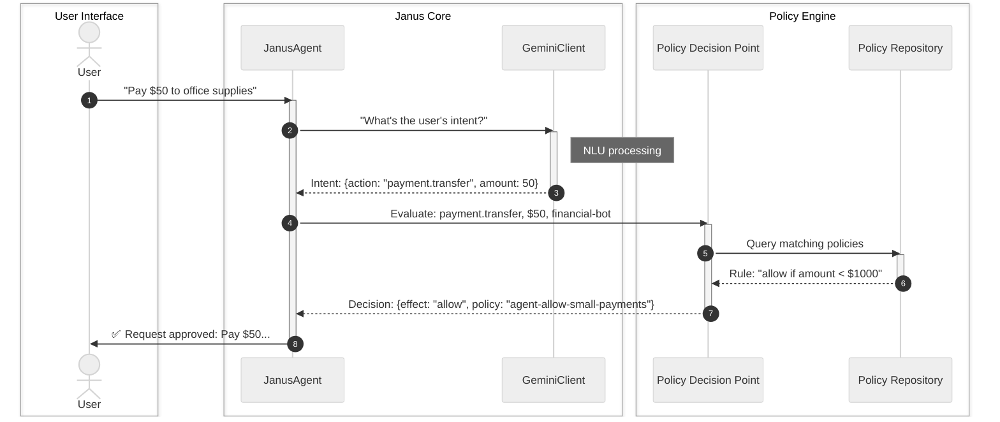

# Chapter 1: Janus Agent

Welcome to the `janus-adk` project! In this first chapter, we'll introduce you to the `JanusAgent`, which is the core of our intelligent system. Think of it as your smart assistant, ready to understand and act on your commands, but always making sure it follows the rules.

### What problem does the Janus Agent solve?

Imagine you're building a smart assistant for a company, perhaps a "financial bot" that can handle requests like paying a bill or transferring money. You want this bot to be helpful, but also safe and compliant.

For example, a user might say:
*   "Pay $50 to office supplies." (This should probably be allowed.)
*   "Transfer $5000 to a new vendor." (This might need approval or have limits.)
*   "Wire $10,000,000 to my personal account." (This should definitely be denied!)

How do you make sure your smart assistant:
1.  **Understands** what the user actually wants?
2.  **Checks** if the request is allowed by company rules *before* doing anything?
3.  **Responds** appropriately, whether it's an approval or a denial with a reason?

The `JanusAgent` is designed to solve exactly these problems. It's the primary interface you'll use to interact with this policy-controlled AI system.

### What is a Janus Agent?

At its heart, the `JanusAgent` is like a specialized, rule-aware chatbot. It's the central point where user requests come in, get understood, get checked against rules, and then get acted upon.

Let's break down its key responsibilities:

| Responsibility             | Description                                                                                                                                                                                               |
| :------------------------- | :-------------------------------------------------------------------------------------------------------------------------------------------------------------------------------------------------------- |
| **Understand Requests**    | It listens to your natural language commands (like "Pay $50 for supplies") and figures out your "intent" – what you want to do (e.g., `payment.transfer`) and with what details (e.g., `amount=$50`). It uses powerful AI models like Gemini for this. |
| **Check Rules**            | Before taking any action, it asks a "bouncer" (the [Policy Decision Point (PDP)](02_policy_decision_point__pdp__.md)) if the request is allowed. This is crucial for security and compliance.                 |
| **Take Action or Respond** | Based on the decision from the [Policy Decision Point (PDP)](02_policy_point__pdp__.md), it either proceeds with the action or tells you why the request was denied.                                     |

### How to use the Janus Agent

Using the `JanusAgent` is straightforward. You create an agent, and then you "run" your natural language requests through it.

First, make sure you have your Google API key set up (instructions are in the project `README.md` if you haven't done this yet). This allows the agent to use Google Gemini for understanding language.

Here's how you can create and use a `JanusAgent`:

```python
from janus_agent.agent import JanusAgent
import asyncio

async def main():
    # 1. Create a Janus Agent
    # Give it a unique ID and a description
    # By default, it will try to use Gemini for understanding.
    agent = JanusAgent("financial-bot", description="AI Financial Assistant")

    # 2. Ask the agent to do something
    # We use 'await' because the agent works asynchronously (in the background)
    user_request = "Pay $100 to supplier for office supplies."
    response, decision, _ = await agent.run(user_request)

    # 3. See the agent's response and the policy decision
    print(f"\nUser: {user_request}")
    print(f"Agent Response: {response}")
    print(f"Policy Decision: {decision['effect']}") # 'allow' or 'deny'
    print(f"Reason: {decision.get('reason', 'N/A')}")

# Run the asynchronous main function
if __name__ == "__main__":
    asyncio.run(main())
```
**What's happening here?**

1.  `JanusAgent("financial-bot", ...)`: We create an instance of our smart assistant, giving it a name (`financial-bot`) and a description.
2.  `await agent.run(user_request)`: We give the agent a natural language request. The `run` method is where all the magic happens: understanding, checking rules, and generating a response.
3.  `response, decision, _`: The `run` method returns three things. For now, we mainly care about:
    *   `response`: The human-friendly answer from the agent (e.g., "✅ Approved: ...").
    *   `decision`: A dictionary telling us if the action was `allow`ed or `deny`ed, and why.

If you run the above code (assuming appropriate policies are in place, which they are by default for small payments), you might see output similar to this:

```
Initialized financial-bot: AI Financial Assistant
Loaded 3 policies
✓ Gemini integration enabled

User: Pay $100 to supplier for office supplies.
Agent Response: ✅ Request approved: Pay $100 to supplier for office supplies. (Policy: agent-allow-small-payments)
Policy Decision: allow
Reason: N/A
```

Now, try changing the request to "Pay $5000 to supplier". You'll likely see a `deny` decision because the default policies prevent larger payments.

### Under the Hood: How the Janus Agent Works

Let's peek behind the curtain to understand the steps a `JanusAgent` takes when you give it a command.

When you call `agent.run("Pay $50 to office supplies")`, here's a simplified sequence of events:



As you can see, the `JanusAgent` acts as the orchestrator. It doesn't do *everything* itself, but rather it delegates specific tasks to specialized components:

1.  **[Gemini Client](04_gemini_client_.md):** This component is responsible for Natural Language Understanding (NLU). It translates your human language request ("Pay $50...") into a structured "intent" (what action, what parameters).
2.  **[Policy Decision Point (PDP)](02_policy_decision_point__pdp__.md):** This is the "bouncer" that evaluates whether an action is allowed or denied based on predefined rules.
3.  **[Policy Repository](03_policy_repository_.md):** The PDP gets its rules from here. This is where all the `YAML` policy files are stored.

Let's look at the `JanusAgent`'s code to see how it initializes these components and uses them in its `run` method.

First, the `__init__` method (the setup code when you create a `JanusAgent`):

```python
# janus_agent/agent.py

from janus_agent.core.policy_repository import PolicyRepository
from janus_agent.core.pdp import PolicyDecisionPoint
from janus_agent.integrations.gemini_client import GeminiClient
# ... other imports ...

class JanusAgent:
    def __init__(self, agent_id: str, description: str = "", use_gemini: bool = True):
        self.agent_id = agent_id
        # ... other setup ...

        # Load policies from a folder
        self.repository = PolicyRepository("policies/examples")
        # Initialize the Policy Decision Point with the loaded policies
        self.pdp = PolicyDecisionPoint(self.repository)

        self.gemini = None
        if use_gemini and os.getenv('GOOGLE_API_KEY'):
            try:
                self.gemini = GeminiClient() # Initialize Gemini client
                # For this chapter, we're simplifying and not showing ADKAgent setup
            except Exception as e:
                print(f"⚠️  Gemini not available: {e}")
```
This snippet shows how the `JanusAgent` sets up its `PolicyRepository` (where rules live), its `PolicyDecisionPoint` (the rule-checker), and optionally its `GeminiClient` (the language understander).

Next, let's look at a simplified version of the `run` method, which executes when you give the agent a command:

```python
# janus_agent/agent.py (simplified run method)

    async def run(self, text: str):
        intent = {}
        # Step 1: Use Gemini to understand the user's request
        if self.gemini:
            intent = await self.gemini.extract_intent(text)
            action = intent.get('action', 'unknown')
            parameters = intent.get('parameters', {})
        else:
            # Fallback if Gemini is not enabled (simpler, hardcoded logic)
            action = "payment.transfer" # Default action
            parameters = {} # No details extracted without Gemini

        # Step 2: Ask the Policy Decision Point if the action is allowed
        decision = self.pdp.evaluate(
            subject=self.agent_id,
            action=action,
            resource='*', # For simplicity, resource is '*'
            attrs=parameters # Details extracted by Gemini
        )

        # Step 3: Formulate a response based on the decision
        response = ""
        if decision['allow']:
            response = f"✅ Request approved: {text} (Policy: {decision['matched_policy']})"
        else:
            response = f"❌ Request denied: {decision['reason']}"

        return response, decision, []
```
This `run` method clearly shows the two main steps: using `self.gemini` to understand the intent, and then using `self.pdp` to evaluate that intent against the policies. Finally, it constructs a response based on the `decision`.

### Conclusion

The `JanusAgent` is your primary interaction point with the `janus-adk` system. It's designed to be smart by understanding natural language requests through Gemini, and safe by enforcing predefined rules through the [Policy Decision Point (PDP)](02_policy_point__pdp__.md). It acts as the central brain that orchestrates language understanding and policy enforcement.

In the next chapter, we'll dive deeper into the "bouncer" itself: the [Policy Decision Point (PDP)](02_policy_decision_point__pdp__.md), and understand how it makes those crucial allow/deny decisions.

[Next Chapter: Policy Decision Point (PDP)](02_policy_decision_point__pdp__.md)

---

<sub><sup>Generated by [AI Codebase Knowledge Builder](https://github.com/The-Pocket/Tutorial-Codebase-Knowledge).</sup></sub> <sub><sup>**References**: [[1]](https://github.com/Ortimus/janus-adk/blob/2866aedb8a565c0ccbc35e43c16fc4d1565ac9c8/README.md), [[2]](https://github.com/Ortimus/janus-adk/blob/2866aedb8a565c0ccbc35e43c16fc4d1565ac9c8/examples/adk_demo/main_demo.py), [[3]](https://github.com/Ortimus/janus-adk/blob/2866aedb8a565c0ccbc35e43c16fc4d1565ac9c8/janus_agent/agent.py)</sup></sub>