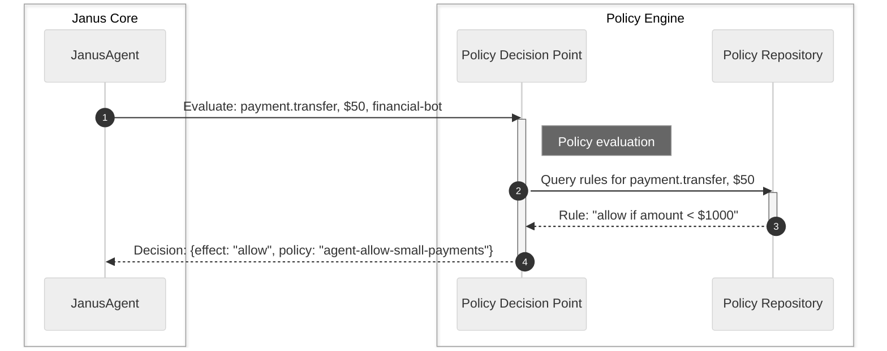

# Chapter 2: Policy Decision Point (PDP)

In the previous chapter, we met the [Janus Agent](01_janus_agent_.md), our smart assistant that understands your commands and takes action. We learned that the `JanusAgent` doesn't just do anything you ask; it first consults a "bouncer" to check if the action is allowed. This "bouncer" is what we call the **Policy Decision Point (PDP)**.

### What Problem Does the Policy Decision Point (PDP) Solve?

Imagine our `JanusAgent` is a financial assistant. A user might tell it: "Pay $100 to office supplies." or "Transfer $1,000,000 to my personal account."

How does the `JanusAgent` know which requests are safe, allowed by company policy, or even require special approval? It can't just guess! It needs a clear set of rules and a component whose sole job is to interpret those rules and make a definitive decision.

This is where the **Policy Decision Point (PDP)** comes in. Think of the PDP as the highly trained security guard at the entrance to a building. Before anyone (like our `JanusAgent` trying to perform an action) can pass, the security guard checks their ID, the reason for their visit, and a rulebook to decide:
*   **Allowed**: "Yes, you can proceed."
*   **Denied**: "No, you cannot enter."
*   **Requires Approval**: "You need special permission before I can let you in."

The PDP's job is to be the ultimate authority on **"what's allowed and what's not"** within the Janus system.

### What is a Policy Decision Point (PDP)?

The **Policy Decision Point (PDP)** is the core "brain" of the Janus system when it comes to security and compliance. It's not involved in understanding language or taking the actual action, but it is responsible for the crucial step of **making a decision** about whether an action *should* happen.

Here are its key responsibilities:

| Responsibility             | Description                                                                                                                                                                                                                                                        |
| :------------------------- | :----------------------------------------------------------------------------------------------------------------------------------------------------------------------------------------------------------------------------------------------------------------- |
| **Rule Evaluation**        | It takes a request (e.g., "transfer $5000") and compares it against a set of predefined rules, known as "policies."                                                                                                                                              |
| **Decision Making**        | Based on these policies, it makes a clear decision: `allow`, `deny`, or `require_approval`.                                                                                                                                                                        |
| **Considering Factors**    | It looks at details like who is asking (`subject`), what they want to do (`action`), what resources are involved (`resource`), and any specific conditions (`attrs` like `amount`).                                                                                  |
| **Hierarchy of Rules**     | Policies can be organized in a hierarchy (e.g., company-wide rules, department rules, individual agent rules). The PDP understands this order to make sure the right rule wins.                                                                                      |
| **Auditable Decisions**    | Every decision made by the PDP is based on specific policies, which means you can always trace *why* a decision was made. This is important for security audits and compliance.                                                                                       |

### How the PDP Works (Simplified)

Let's revisit our `JanusAgent` and see how the PDP fits in. When the `JanusAgent` receives a request, it prepares the details and hands them over to the PDP for a decision.



As you can see, the PDP is the central piece here. It doesn't store the rules itself, but it knows how to **read** them from the [Policy Repository](03_policy_repository_.md) and then use them to evaluate the request.

### Using the Policy Decision Point (PDP)

While the `JanusAgent` uses the PDP internally, you can also interact with the PDP directly if you want to test specific policy evaluations without the full agent pipeline. This helps isolate and understand its behavior.

Let's see how you might directly ask the PDP to make a decision:

```python
from janus_agent.core.policy_repository import PolicyRepository
from janus_agent.core.pdp import PolicyDecisionPoint
import os

# 1. Load your rulebook (policies)
#    (The 'policies/examples' folder contains our example rules)
policy_dir = os.path.join(os.path.dirname(__file__), "..", "..", "policies", "examples")
repository = PolicyRepository(policy_dir)

# 2. Create the security guard (PDP) with the rulebook
pdp = PolicyDecisionPoint(repository)

# 3. Ask the PDP directly: "Is this action allowed?"
#    Imagine an agent named "financial-bot" wants to "payment.transfer" $50
decision_small = pdp.evaluate(
    subject="financial-bot",
    action="payment.transfer",
    resource="*", # '*' means any resource
    attrs={"amount": 50} # Details like the amount
)
print(f"Decision for $50 payment: {decision_small['effect']}")
print(f"  Reason: {decision_small.get('reason', 'N/A')}")

# 4. Try a larger amount, say $5000
decision_large = pdp.evaluate(
    subject="financial-bot",
    action="payment.transfer",
    resource="*",
    attrs={"amount": 5000}
)
print(f"Decision for $5000 payment: {decision_large['effect']}")
print(f"  Reason: {decision_large.get('reason', 'N/A')}")
```

**What's happening here?**

1.  `PolicyRepository("policies/examples")`: We first load all the policy files (which are usually in YAML format) from a specific folder. This is like giving the security guard their rulebook.
2.  `PolicyDecisionPoint(repository)`: We create an instance of our PDP, handing it the loaded rulebook.
3.  `pdp.evaluate(...)`: This is the core method. You give it:
    *   `subject`: Who is requesting the action (e.g., "financial-bot").
    *   `action`: What they want to do (e.g., "payment.transfer").
    *   `resource`: What they want to do it to (e.g., "\*" for anything, or a specific system).
    *   `attrs`: Any additional details (e.g., `amount: 50`).
4.  The PDP then returns a dictionary containing its decision, including the `effect` (e.g., `allow` or `deny`) and the `reason`.

If you run this code, assuming the default policies are in place, you would likely see output like this:

```
Decision for $50 payment: allow
  Reason: Allow by policy agent-allow-small-payments
Decision for $5000 payment: deny
  Reason: Deny by policy agent-deny-large-payments
```
This clearly shows the PDP making decisions based on the `amount` attribute, just like our financial bot scenario.

### Under the Hood: The PDP's Inner Workings

Let's peek at the actual code for the `PolicyDecisionPoint` to understand how it makes these smart decisions.

The `PolicyDecisionPoint` (found in `janus_agent/core/pdp.py`) is initialized with a `PolicyRepository`, which gives it access to all the policies.

```python
# janus_agent/core/pdp.py (simplified __init__)

from typing import Dict, List, Any, Optional

class PolicyDecisionPoint:
    def __init__(self, repository):
        self.repository = repository # Stores the rulebook!
        # ... other setup ...
```

The main method we used, `pdp.evaluate()`, is a simpler version of `pdp.evaluate_all()`, which does the heavy lifting of gathering *all* matching policies before determining the final decision.

```python
# janus_agent/core/pdp.py (simplified evaluate and evaluate_all)

class PolicyDecisionPoint:
    # ... __init__ and other methods ...

    def evaluate(self, subject: str, action: str, resource: Optional[str] = None,
                 attrs: Optional[Dict[str, Any]] = None) -> Dict[str, Any]:
        """Returns the *final decision*."""
        full_evaluation_result = self.evaluate_all(subject, action, resource, attrs)
        return full_evaluation_result["final"]

    def evaluate_all(self, subject: str, action: str, resource: Optional[str] = None,
                     attrs: Optional[Dict[str, Any]] = None) -> Dict[str, Any]:
        """
        Performs full multi-policy evaluation.
        Returns: {"matches": [...], "final": {...}}
        """
        if attrs is None:
            attrs = {}

        context = { # Prepare all the details for evaluation
            "subject": subject,
            "action": action,
            "resource": resource or "*",
            **attrs,
        }

        policies = self.repository.list() # Get all rules from the rulebook
        match_results = []

        # 1. Check each policy to see if it *matches* the request details
        for p in policies:
            matches_this_policy = self._matches(p, context) # Is this rule applicable?
            match_results.append({
                "policy": p.get("id"),
                "level": p.get("level", "agent"),
                "priority": p.get("priority", 50),
                "effect": p.get("effect"),
                "matches": matches_this_policy,
                "result": self._result_for_single_policy(p, matches_this_policy)
            })

        # 2. Determine the *final decision* from all matching policies
        #    This is where hierarchy and priority come into play!
        final_decision = self._compute_final_decision(match_results)

        return {
            "matches": match_results, # All policies checked and their outcomes
            "final": final_decision,  # The one, ultimate decision
        }
```

Here’s a breakdown of the key steps:

1.  **Gather Context**: The `evaluate_all` method first takes all the input (subject, action, attributes like amount) and combines them into a `context` dictionary.
2.  **Retrieve Policies**: It then asks the `PolicyRepository` for all the known policies (rules).
3.  **Individual Policy Matching (`_matches`)**: For each policy, the `_matches` method checks if that specific policy applies to the current request. This involves looking at `subject`, `action`, `resource` patterns (like `finance-*`), and any conditions like `amount_max` or `amount_min`.
4.  **Compute Final Decision (`_compute_final_decision`)**: After checking *all* policies, the `_compute_final_decision` method takes all the policies that matched and uses a strict order of precedence to determine the single final outcome. This order is:
    *   **Level**: Enterprise-level policies beat Domain-level policies, which beat Agent-level policies.
    *   **Priority**: Within the same level, policies with a lower priority number win (e.g., priority 10 beats priority 20).
    *   **Effect**: `deny` decisions always override `require_approval`, which always overrides `allow`.
    This ensures that the most important and specific rules always win.

### Conclusion

The Policy Decision Point (PDP) is the heart of policy enforcement in `janus-adk`. It acts as the system's security guard, diligently evaluating every request against a rulebook to ensure that AI agents operate safely and within defined boundaries. By understanding who is doing what, to what, and under what conditions, the PDP makes crucial allow/deny/approve decisions that are both auditable and consistent.

Now that we understand how the PDP makes decisions, in the next chapter, we'll dive into where these "rules" (policies) actually come from: the [Policy Repository](03_policy_repository.md).

[Next Chapter: Policy Repository](03_policy_repository.md)

---

<sub><sup>Generated by [AI Codebase Knowledge Builder](https://github.com/The-Pocket/Tutorial-Codebase-Knowledge).</sup></sub> <sub><sup>**References**: [[1]](https://github.com/Ortimus/janus-adk/blob/2866aedb8a565c0ccbc35e43c16fc4d1565ac9c8/README.md), [[2]](https://github.com/Ortimus/janus-adk/blob/2866aedb8a565c0ccbc35e43c16fc4d1565ac9c8/demo_analysis.md), [[3]](https://github.com/Ortimus/janus-adk/blob/2866aedb8a565c0ccbc35e43c16fc4d1565ac9c8/examples/adk_demo/additional_tests.py), [[4]](https://github.com/Ortimus/janus-adk/blob/2866aedb8a565c0ccbc35e43c16fc4d1565ac9c8/examples/adk_demo/main_demo.py), [[5]](https://github.com/Ortimus/janus-adk/blob/2866aedb8a565c0ccbc35e43c16fc4d1565ac9c8/janus_agent/adapters/adk_adapter.py), [[6]](https://github.com/Ortimus/janus-adk/blob/2866aedb8a565c0ccbc35e43c16fc4d1565ac9c8/janus_agent/agent.py), [[7]](https://github.com/Ortimus/janus-adk/blob/2866aedb8a565c0ccbc35e43c16fc4d1565ac9c8/janus_agent/core/pdp.py)</sup></sub>
