# Chapter 3: Policy Repository

In the previous chapter, we learned about the [Policy Decision Point (PDP)](02_policy_decision_point__pdp__.md), the "bouncer" that decides whether an action is allowed or denied. The PDP is smart because it knows how to *evaluate* rules. But where do these rules come from? The PDP doesn't invent them; it needs a source of truth, a rulebook to consult.

This is exactly the problem the **Policy Repository** solves.

### What Problem Does the Policy Repository Solve?

Imagine you're managing a bustling library, but instead of books, it's filled with all the security rules and operational guidelines for your AI agents. You need a system that can:
1.  **Store** all these rules in an organized manner.
2.  **Load** them up when the system starts.
3.  **Provide access** to them quickly when the [Policy Decision Point (PDP)](02_policy_decision_point__pdp__.md) asks for them.
4.  Allow human administrators to **easily define and update** these rules without touching any code.

Without a central, organized place for policies, managing an AI system that needs to follow complex rules would be chaotic. You'd have rules scattered everywhere, hard to find, and even harder to update consistently.

The **Policy Repository** is designed to be this central, organized place. It's the library or filing cabinet for *all* your security policies, ensuring they are always ready for the PDP to use.

### What is a Policy Repository?

The **Policy Repository** is a dedicated component responsible for managing all the policies (rules) that govern your `janus-adk` system. Think of it as the ultimate "rulebook holder."

Here are its key responsibilities:

| Responsibility       | Description                                                                                                          |
| :------------------- | :------------------------------------------------------------------------------------------------------------------- |
| **Loading Policies** | It reads policy definitions from files, typically `YAML` files, when the system starts or needs an update.            |
| **Storing Policies** | It holds these loaded policies in memory, making them readily available.                                             |
| **Providing Access** | It offers methods for the [Policy Decision Point (PDP)](02_policy_decision_point__pdp__.md) to retrieve policies for evaluation. |
| **Organizing Rules** | It ensures policies are stored in a structured way, often from a designated directory, making them easy to manage.     |

A crucial aspect of `janus-adk` policies is that they are defined in **YAML files**. This means you, as an administrator, can easily read, write, and modify these rules using a simple text editor, making policy management straightforward and transparent.

Here's an example of what a policy might look like in a YAML file:

```yaml
# policies/examples/agent-payment-processor.yaml
policies:
  - id: "agent-allow-small-payments"
    description: "Allow payments under $1000"
    level: "agent"
    action: "payment.transfer"
    subject: "*"
    resource: "*"
    effect: "allow"
    match:
      amount_max: 999
    priority: 10
```

This YAML snippet defines a policy named `agent-allow-small-payments` that allows any agent (`subject: "*"`) to perform a `payment.transfer` action, as long as the `amount` is less than $999. It's concise and human-readable!

### How the Policy Repository Works (Simplified)

Let's put the Policy Repository back into the overall `janus-adk` flow.

```mermaid
%%{init: {'theme': 'neutral'}}%%
sequenceDiagram
    autonumber
    
    box User Interface
        actor User
    end
    
    box Janus Core
        participant JanusAgent
    end
    
    box Policy Engine
        participant PDP as Policy Decision Point
        participant PolicyRepo as Policy Repository
    end

    User->>JanusAgent: "Pay $50 to office supplies"
    activate JanusAgent
    JanusAgent->>PDP: Evaluate: payment.transfer, $50, financial-bot
    activate PDP
    Note right of PDP: Policy evaluation
    PDP->>PolicyRepo: Fetch relevant rules
    activate PolicyRepo
    Note right of PolicyRepo: Load from YAML
    PolicyRepo-->>PDP: Returns matching policy rules
    deactivate PolicyRepo
    PDP-->>JanusAgent: Decision: {effect: "allow", policy: "agent-allow-small-payments"}
    deactivate PDP
    JanusAgent->>User: ✅ Request approved: Pay $50...
    deactivate JanusAgent
```



As you can see, the Policy Repository is consulted by the [Policy Decision Point (PDP)](02_policy_decision_point__pdp__.md). It doesn't participate in the decision-making itself, but it's the vital source that provides all the rules for the PDP to consider.

### Using the Policy Repository

While the [Janus Agent](01_janus_agent_.md) and [Policy Decision Point (PDP)](02_policy_decision_point__pdp__.md) handle the Policy Repository automatically, you can directly interact with it to understand its functionality. This is useful for debugging or when you want to inspect what policies are loaded.

First, let's make sure our code can find the example policies:

```python
import os
from janus_agent.core.policy_repository import PolicyRepository

# Construct the path to the policies/examples directory
current_file_dir = os.path.dirname(__file__)
policy_dir = os.path.join(current_file_dir, "..", "..", "policies", "examples")

# 1. Initialize the Policy Repository
#    This tells the repository where to find the policy files.
repository = PolicyRepository(policy_dir)

# 2. Check how many policies were loaded
print(f"Total policies loaded: {repository.size()}")

# 3. List all loaded policies (just showing first few for brevity)
print("\nFirst 2 loaded policies:")
for i, policy in enumerate(repository.list()):
    if i >= 2:
        break
    print(f"  - ID: {policy['id']}, Action: {policy['action']}, Effect: {policy['effect']}")

# 4. Get a specific policy by its ID
specific_policy_id = "agent-allow-small-payments"
specific_policy = repository.get(specific_policy_id)

if specific_policy:
    print(f"\nDetails for policy '{specific_policy_id}':")
    print(f"  Description: {specific_policy['description']}")
    print(f"  Level: {specific_policy['level']}")
    print(f"  Match conditions: {specific_policy['match']}")
else:
    print(f"\nPolicy '{specific_policy_id}' not found.")
```

**What's happening here?**

1.  `PolicyRepository(policy_dir)`: We create an instance of the `PolicyRepository`. When you pass a directory, it automatically scans that directory for YAML files and loads any policies it finds. This is like telling the library to stock up its shelves with new rulebooks.
2.  `repository.size()`: This method tells us how many policies were successfully loaded.
3.  `repository.list()`: This returns a list of all the policy dictionaries that were loaded.
4.  `repository.get(policy_id)`: This allows you to retrieve a specific policy by its unique `id` (e.g., `"agent-allow-small-payments"`).

If you run the above code, you would likely see output similar to this (the exact count and order might vary slightly depending on your policy files):

```
Loaded 3 policies from .../policies/examples
Total policies loaded: 3

First 2 loaded policies:
  - ID: agent-allow-small-payments, Action: payment.transfer, Effect: allow
  - ID: agent-deny-large-payments, Action: payment.transfer, Effect: deny

Details for policy 'agent-allow-small-payments':
  Description: Allow payments under $1000
  Level: agent
  Match conditions: {'amount_max': 999}
```

This output confirms that the repository successfully loaded policies from your YAML files and can provide access to them.

### Under the Hood: The Policy Repository's Inner Workings

Let's look at the `PolicyRepository` code (`janus_agent/core/policy_repository.py`) to understand how it loads and stores these policies.

First, its `__init__` method sets up the internal storage and, if a directory is provided, starts loading policies:

```python
# janus_agent/core/policy_repository.py (simplified __init__)

import yaml
from pathlib import Path
from typing import Dict, List, Any, Optional
import logging

class PolicyRepository:
    def __init__(self, policy_dir: Optional[str] = None):
        self.policies: Dict[str, Dict] = {} # This dictionary holds all policies by ID
        # ... other setup like indexes ...
        self.logger = logging.getLogger(__name__)

        if policy_dir:
            count = self.load_all_policies_from_directory(policy_dir)
            self.logger.info(f"Loaded {count} policies from {policy_dir}")
```
When you create a `PolicyRepository`, it initializes an empty dictionary `self.policies`. If `policy_dir` is given, it immediately calls `load_all_policies_from_directory` to populate this dictionary.

The `load_all_policies_from_directory` method is responsible for scanning the specified folder:

```python
# janus_agent/core/policy_repository.py (simplified load_all_policies_from_directory)

class PolicyRepository:
    # ... __init__ ...

    def load_all_policies_from_directory(self, directory: str) -> int:
        """Load all YAML files from directory"""
        count = 0
        policy_path = Path(directory)

        if not policy_path.exists():
            self.logger.warning(f"Policy directory {directory} does not exist")
            return 0

        # Find all .yaml files in the directory and its subdirectories
        yaml_files = list(policy_path.glob("**/*.yaml"))
        for yaml_file in yaml_files:
            if ".disabled" not in str(yaml_file): # Skip disabled files
                try:
                    # For each YAML file, load the policies within it
                    policies_in_file = self.load_policies_from_yaml(str(yaml_file))
                    count += len(policies_in_file)
                except Exception as e:
                    self.logger.error(f"Failed to load {yaml_file}: {e}")
        return count
```
This method uses `pathlib` to find all `YAML` files and then delegates the actual parsing of each file to `load_policies_from_yaml`.

The `load_policies_from_yaml` method reads a single YAML file and extracts the policies:

```python
# janus_agent/core/policy_repository.py (simplified load_policies_from_yaml)

class PolicyRepository:
    # ... methods ...

    def load_policies_from_yaml(self, yaml_path: str, level=None) -> List[Dict]:
        """Load policies from YAML as simple dicts"""
        with open(yaml_path, 'r') as f:
            data = yaml.safe_load(f) # Use the PyYAML library to parse YAML

        if not data or 'policies' not in data:
            return []

        policies = []
        for p in data.get('policies', []):
            policy = { # Create a policy dictionary
                'id': p.get('id'),
                'action': p.get('action'),
                'subject': p.get('subject', '*'),
                'resource': p.get('resource', '*'),
                'effect': p.get('effect', 'deny'),
                'description': p.get('description', ''),
                'level': p.get('level', 'agent'),
                'match': p.get('match', {}),
                'priority': p.get('priority', 50),
            }

            if policy['id'] and policy['action']:
                self.add_policy(policy) # Add the policy to the repository's internal storage
                policies.append(policy)
        return policies
```
This method uses the `PyYAML` library (`yaml.safe_load`) to parse the YAML file content into Python dictionaries. It then iterates through the list of policies defined in the file, structures them, and finally calls `add_policy` for each one.

The `add_policy` method is where each individual policy is stored:

```python
# janus_agent/core/policy_repository.py (simplified add_policy)

class PolicyRepository:
    # ... methods ...

    def add_policy(self, policy: Dict) -> None:
        """Add a dict policy"""
        policy_id = policy.get('id')
        if not policy_id:
            return

        self.policies[policy_id] = policy # Store the policy in the 'policies' dictionary by its ID

        # These lines create "indexes" for faster lookup later (though PDP currently lists all)
        # self.action_index[policy.get('action', '*')].add(policy_id)
        # self.subject_index[policy.get('subject', '*')].add(policy_id)
        # self.resource_index[policy.get('resource', '*')].add(policy_id)
```
This is the heart of the storage. Each policy dictionary is stored in the `self.policies` dictionary, using its `id` as the key. This allows for quick retrieval of policies by their unique identifier. The commented-out indexing lines hint at how a more complex system might pre-index policies for even faster searches, but for `janus-adk`, the current approach of listing all policies is efficient enough.

### Conclusion

The Policy Repository is the foundational component that ensures all security and operational rules for your AI agents are properly loaded, stored, and accessible. By using human-readable YAML files, it empowers administrators to easily define and update the system's behavior without requiring code changes. It acts as the trusted library of rules, providing the [Policy Decision Point (PDP)](02_policy_decision_point__pdp__.md) with the necessary information to make informed decisions.

Now that we understand how policies are stored and retrieved, we'll move on to explore another crucial piece of the puzzle: the [Gemini Client](04_gemini_client_.md), which gives our agents their intelligence to understand natural language.

[Next Chapter: Gemini Client](04_gemini_client_.md)

---

<sub><sup>Generated by [AI Codebase Knowledge Builder](https://github.com/The-Pocket/Tutorial-Codebase-Knowledge).</sup></sub> <sub><sup>**References**: [[1]](https://github.com/Ortimus/janus-adk/blob/2866aedb8a565c0ccbc35e43c16fc4d1565ac9c8/README.md), [[2]](https://github.com/Ortimus/janus-adk/blob/2866aedb8a565c0ccbc35e43c16fc4d1565ac9c8/janus_agent/adapters/adk_adapter.py), [[3]](https://github.com/Ortimus/janus-adk/blob/2866aedb8a565c0ccbc35e43c16fc4d1565ac9c8/janus_agent/agent.py), [[4]](https://github.com/Ortimus/janus-adk/blob/2866aedb8a565c0ccbc35e43c16fc4d1565ac9c8/janus_agent/core/policy_repository.py), [[5]](https://github.com/Ortimus/janus-adk/blob/2866aedb8a565c0ccbc35e43c16fc4d1565ac9c8/policies/examples/agent-payment-processor.yaml), [[6]](https://github.com/Ortimus/janus-adk/blob/2866aedb8a565c0ccbc35e43c16fc4d1565ac9c8/policies/examples/domain-finance.yaml), [[7]](https://github.com/Ortimus/janus-adk/blob/2866aedb8a565c0ccbc35e43c16fc4d1565ac9c8/policies/examples/enterprise-security.yaml)</sup></sub>