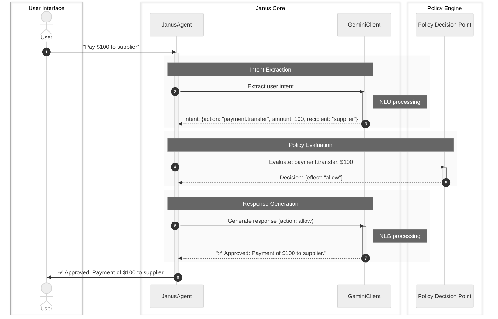

# Chapter 4: Gemini Client

In the previous chapter, we explored the [Policy Repository](03_policy_repository.md), which acts as the rulebook holder for our `janus-adk` system. We saw how the [Policy Decision Point (PDP)](02_policy_decision_point__pdp__.md) consults this rulebook to make decisions. But before any rules can be checked, our agent needs to understand what the user is actually asking for in plain human language!

This is exactly the problem the **Gemini Client** solves.

### What Problem Does the Gemini Client Solve?

Imagine you're talking to a smart assistant like our [Janus Agent](01_janus_agent_.md). You don't want to type in rigid computer commands; you want to speak naturally, like: "Pay $100 to the office supplies vendor for this month's order."

How does a computer system:
1.  **Understand** that "Pay $100 to the office supplies vendor" means you want to perform a `payment.transfer` action?
2.  **Extract** the key details like the `amount` ($100) and the `recipient` ("office supplies vendor") from your sentence?
3.  **Generate** a natural, helpful reply like "✅ Approved: Payment of $100 to office supplies vendor has been processed." after the system has made a decision?

The `JanusAgent` relies on the **Gemini Client** to be its "language expert." It's the component that bridges the gap between human language and structured computer commands, making the agent intelligent and conversational.

### What is a Gemini Client?

The **Gemini Client** is your `janus-adk` project's direct link to Google's powerful **Gemini** large language model (LLM). Think of it as the `JanusAgent`'s personal interpreter and conversationalist.

Its main responsibilities are:

| Responsibility             | Description                                                                                                                                                                                                                                                                                               |
| :------------------------- | :-------------------------------------------------------------------------------------------------------------------------------------------------------------------------------------------------------------------------------------------------------------------------------------------------------- |
| **Natural Language Understanding (NLU)** | It listens to your spoken or typed requests (like "Pay $100...") and figures out your "intent" – what you want to do (e.g., `payment.transfer`) and the specific details (e.g., `amount: $100`, `recipient: office supplies`).                                                                     |
| **Information Extraction** | From unstructured text, it skillfully pulls out crucial pieces of information (like amounts, names, dates, types of actions) and organizes them into a structured format (e.g., a dictionary or JSON object) that the rest of the system can easily use.                                                  |
| **Response Generation**    | After the system (including the [Policy Decision Point (PDP)](02_policy_decision_point__pdp__.md)) has made its decision (allow or deny), the Gemini Client generates a natural, polite, and context-aware response back to you. This makes the `JanusAgent` sound like a helpful human assistant. |
| **Conversational Ability** | It allows the agent to maintain context over several turns, making conversations feel more natural and intelligent.                                                                                                                                                                                  |

Without the Gemini Client, the `JanusAgent` would be deaf to natural language and mute in its responses. It's the key to an intuitive and intelligent user experience.

### How the Gemini Client Works (Simplified)

Let's see how the Gemini Client fits into the overall flow of the `JanusAgent` when you make a request.





As you can see, the Gemini Client is primarily involved in the very first step (understanding your request) and the very last step (generating a user-friendly response). It's the voice and ears of our `JanusAgent`.

### Using the Gemini Client

The [Janus Agent](01_janus_agent_.md) uses the Gemini Client internally. You interact with the `JanusAgent`, and it automatically handles communication with Gemini. However, if you wanted to test or use the Gemini Client's core functions directly, you could.

First, you need to ensure your `GOOGLE_API_KEY` is set up in your environment (as mentioned in the `README.md` and previous chapters).

Here's how you might directly use the `GeminiClient` to understand a request and generate a response:

```python
import asyncio
import os
from janus_agent.integrations.gemini_client import GeminiClient

async def demonstrate_gemini_client():
    # Make sure your API key is set!
    if not os.getenv('GOOGLE_API_KEY'):
        print("⚠️  GOOGLE_API_KEY not set. Cannot run Gemini Client demo.")
        return

    # 1. Initialize the Gemini Client
    # This connects to Google's Gemini model.
    gemini_client = GeminiClient()

    user_request = "Transfer $250 to marketing for the new campaign."

    # 2. Extract the intent from a user's request
    print(f"\nUser says: '{user_request}'")
    intent_result = await gemini_client.extract_intent(user_request)

    print(f"Gemini extracts action: {intent_result.get('action')}")
    print(f"Gemini extracts parameters: {intent_result.get('parameters')}")
    # Expected output: action: payment.transfer, parameters: {'amount': 250.0, 'recipient': 'marketing'}

    # 3. Simulate a policy decision (e.g., from the PDP)
    # Let's imagine the PDP allowed this payment.
    mock_policy_decision = {
        "effect": "allow",
        "reason": "Payment within budget limits",
        "matched_policy": "agent-allow-small-payments"
    }

    # 4. Generate a natural language response based on the decision
    response_text = await gemini_client.generate_response(
        user_input=user_request,
        policy_decision=mock_policy_decision
    )

    print(f"\nGemini generates response:\n{response_text}")
    # Expected output: A polite confirmation message.

# Run the asynchronous function
if __name__ == "__main__":
    asyncio.run(demonstrate_gemini_client())
```

**What's happening here?**

1.  `gemini_client = GeminiClient()`: We create an instance of our Gemini Client. This establishes the connection to the Google Gemini service.
2.  `await gemini_client.extract_intent(user_request)`: We pass the raw human language request to `extract_intent`. Gemini then analyzes it and returns a structured dictionary containing the `action` and `parameters`. This is the "understanding" part.
3.  `await gemini_client.generate_response(...)`: After simulating a `policy_decision`, we ask Gemini to craft a polite, human-like response. This is the "speaking" part.

If you run this code (with your `GOOGLE_API_KEY` set), you'll see how Gemini translates the natural language into structured data and then back into a friendly response.

```
✓ Initialized Gemini client with model: gemini-2.5-flash

User says: 'Transfer $250 to marketing for the new campaign.'
Gemini extracts action: payment.transfer
Gemini extracts parameters: {'amount': 250.0, 'recipient': 'marketing', 'type': 'transfer'}

Gemini generates response:
Acknowledged. Your request to transfer $250 to marketing for the new campaign has been approved and will be processed.
```

### Under the Hood: The Gemini Client's Inner Workings

Let's peek at the actual code for the `GeminiClient` (found in `janus_agent/integrations/gemini_client.py`) to understand how it communicates with the Google Gemini model.

First, the `__init__` method sets up the connection:

```python
# janus_agent/integrations/gemini_client.py (simplified __init__)

import os
import google.generativeai as genai
from google.generativeai.types import HarmCategory, HarmBlockThreshold

class GeminiClient:
    def __init__(self, api_key: Optional[str] = None, model_name: str = "gemini-2.5-flash"):
        self.api_key = api_key or os.getenv('GOOGLE_API_KEY')
        if not self.api_key:
            raise ValueError("Google API key required...")

        genai.configure(api_key=self.api_key) # Connect to Google's API

        self.model = genai.GenerativeModel( # Configure the Gemini model
            model_name=model_name,
            generation_config={
                'temperature': 0.7, # How creative/random the responses are
                'max_output_tokens': 8192,
            },
            safety_settings={ # Important for financial operations!
                HarmCategory.HARM_CATEGORY_DANGEROUS_CONTENT: HarmBlockThreshold.BLOCK_NONE,
                # ... other safety settings ...
            }
        )
        print(f"✓ Initialized Gemini client with model: {model_name}")
```
Here, `genai.configure(api_key=self.api_key)` establishes the link to Google's services. Then, `genai.GenerativeModel` creates an instance of the Gemini model itself. We configure it with `generation_config` (like `temperature` for how "creative" Gemini should be) and crucially, `safety_settings`. For a financial bot, we might relax some safety settings to allow it to discuss money, but in a controlled environment, being very careful is key.

Next, let's look at the `extract_intent` method, which is responsible for understanding your request:

```python
# janus_agent/integrations/gemini_client.py (simplified extract_intent)

    async def extract_intent(self, user_input: str) -> Dict[str, Any]:
        prompt = f"""
        Analyze this user request and extract the intent and parameters.
        User input: "{user_input}"

        Return a JSON object with:
        - action: one of [payment.transfer, payment.wire, ...]
        - parameters: object with relevant parameters (amount, recipient, ...)
        ...
        Response (JSON only):
        """

        response = self.model.generate_content(prompt) # Send the prompt to Gemini

        try:
            # Parse JSON response from Gemini
            text = response.text.strip()
            # ... cleanup of potential markdown formatting ...
            result = json.loads(text.strip())
            return result
        except:
            # Fallback if parsing fails
            return {"action": "help.request", "parameters": {"original": user_input}}
```
The `extract_intent` method uses a carefully designed `prompt`. This prompt is like giving very specific instructions to Gemini: "Here's a user's sentence. I need you to give me back a JSON object with an `action` and `parameters` like `amount` and `recipient`." Gemini then uses its powerful language understanding capabilities to follow these instructions. `self.model.generate_content(prompt)` is the actual call to the Gemini API. The code then tries to parse the text response from Gemini as JSON.

Finally, the `generate_response` method helps the agent speak back to the user:

```python
# janus_agent/integrations/gemini_client.py (simplified generate_response)

    async def generate_response(self,
                                user_input: str,
                                policy_decision: Dict[str, Any],
                                context: Optional[str] = None) -> str:
        effect = policy_decision.get('effect', 'deny')
        reason = policy_decision.get('reason', '')

        prompt = f"""
        Generate a helpful, professional response for this financial assistant scenario.

        User request: "{user_input}"
        Policy decision: {effect}
        Policy reason: {reason}
        {f"Additional context: {context}" if context else ""}

        Guidelines:
        - If ALLOWED: Confirm the action will be processed
        - If DENIED: Explain why politely and suggest alternatives
        - Be concise but helpful
        ...
        Response:
        """

        response = self.model.generate_content(prompt) # Send the prompt to Gemini
        return response.text.strip()
```
Similar to `extract_intent`, `generate_response` also uses a `prompt`. This time, the prompt includes the original `user_input`, the `policy_decision` (`effect` like `allow` or `deny`, and the `reason`), and any `context`. Gemini uses this information to craft a natural and appropriate response, following the `Guidelines` provided in the prompt (e.g., confirm if allowed, explain if denied).

### Conclusion

The Gemini Client is the `janus-adk` system's vital connection to the world of human language. It empowers the [Janus Agent](01_janus_agent_.md) to understand complex user requests by extracting key intentions and details, and to communicate back with natural, context-aware responses. By acting as the intelligent interpreter, it makes the entire system user-friendly and highly effective.

Now that we've covered the smart brain that understands and speaks, we'll look at how all these components come together and interact within the broader Google Agent Development Kit (ADK) ecosystem.

[Next Chapter: ADK Adapter (Agent & Orchestrator)](05_adk_adapter__agent___orchestrator__.md)

---

<sub><sup>Generated by [AI Codebase Knowledge Builder](https://github.com/The-Pocket/Tutorial-Codebase-Knowledge).</sup></sub> <sub><sup>**References**: [[1]](https://github.com/Ortimus/janus-adk/blob/2866aedb8a565c0ccbc35e43c16fc4d1565ac9c8/.env.template), [[2]](https://github.com/Ortimus/janus-adk/blob/2866aedb8a565c0ccbc35e43c16fc4d1565ac9c8/README.md), [[3]](https://github.com/Ortimus/janus-adk/blob/2866aedb8a565c0ccbc35e43c16fc4d1565ac9c8/examples/adk_demo/main_demo.py), [[4]](https://github.com/Ortimus/janus-adk/blob/2866aedb8a565c0ccbc35e43c16fc4d1565ac9c8/janus_agent/adapters/adk_adapter.py), [[5]](https://github.com/Ortimus/janus-adk/blob/2866aedb8a565c0ccbc35e43c16fc4d1565ac9c8/janus_agent/agent.py), [[6]](https://github.com/Ortimus/janus-adk/blob/2866aedb8a565c0ccbc35e43c16fc4d1565ac9c8/janus_agent/integrations/gemini_client.py)</sup></sub>