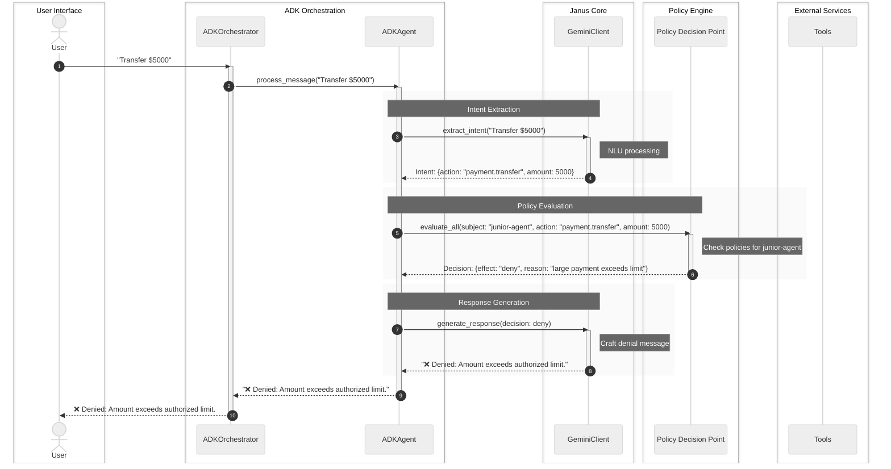

# Chapter 5: ADK Adapter (Agent & Orchestrator)

In the previous chapter, we explored the [Gemini Client](04_gemini_client_.md), the intelligent "voice and ears" that allows our [Janus Agent](01_janus_agent_.md) to understand natural language and respond thoughtfully. We've seen how `JanusAgent` uses the [Policy Decision Point (PDP)](02_policy_decision_point__pdp__.md) and [Policy Repository](03_policy_repository_.md) to enforce rules. Now, let's bring it all together and see how `janus-adk` integrates with a powerful framework called Google's Agent Development Kit (ADK).

### What Problem Does the ADK Adapter Solve?

Imagine you're building a highly sophisticated AI system for a large financial institution. You don't just need *one* smart assistant; you need many:
*   A "Junior Analyst Bot" that can handle small tasks but has strict spending limits.
*   A "Senior Manager Bot" with higher approval limits and access to more sensitive functions.
*   A "Compliance Officer Bot" that can only monitor transactions and flag suspicious activity, but never initiate payments.
*   Perhaps a future "Customer Service Bot" that can only retrieve information, not perform actions.

How do you manage all these different AI agents, each with unique roles, rules, and capabilities, within a standardized framework? And how do you ensure they can all register and use specific "tools" (like "process payment" or "check balance") in a consistent way that's recognized by a broader agent ecosystem?

The **ADK Adapter** is designed to solve exactly this challenge. It acts as the bridge that makes our powerful `JanusAgent` components compatible with Google's ADK. It allows us to create **multiple, specialized `JanusAgent` instances**, each tailored with specific policies, and manage them all efficiently.

### What is an ADK Adapter (Agent & Orchestrator)?

The ADK Adapter consists of two main parts: the `ADKAgent` and the `ADKOrchestrator`. They work hand-in-hand to integrate `janus-adk` into the Google ADK ecosystem and manage multiple intelligent agents.

Let's break them down:

| Component         | Description                                                                                                                                                                                                                                                                                                                                                         | Analogy                                                                                                                                         |
| :---------------- | :------------------------------------------------------------------------------------------------------------------------------------------------------------------------------------------------------------------------------------------------------------------------------------------------------------------------------------------------------------------ | :---------------------------------------------------------------------------------------------------------------------------------------------- |
| **`ADKAgent`**    | This is a special wrapper around the core `JanusAgent` functionality. It makes our agent compatible with the ADK framework. Its main job is to register and execute "tools" (like `process_payment` or `check_balance`) in a standardized way that the ADK understands. It effectively transforms our smart, policy-aware `JanusAgent` into an ADK-compliant agent. | Think of `JanusAgent` as a powerful car engine. The `ADKAgent` is like a standard car chassis and dashboard that allows the engine to be integrated into any car model recognized by a larger automotive industry. |
| **`ADKOrchestrator`** | This is the "manager" that creates and oversees *multiple* `ADKAgent` instances. Each `ADKAgent` it creates can be given a different ID (like "junior-payment-agent" or "senior-finance-agent"), which in turn allows them to have different policy profiles (rules) managed by our [Policy Decision Point (PDP)](02_policy_decision_point__pdp__.md). It facilitates complex multi-agent workflows. | This is the car factory manager who oversees the production line, creating many specialized car models (ADKAgents), each with different features and safety ratings, using the same core engine (JanusAgent). |

In short, the `ADKAgent` makes a single `JanusAgent` "ADK-ready" and enables it to use tools, while the `ADKOrchestrator` allows you to create and manage a whole team of these specialized `ADKAgent`s, each with their own unique rulebook, all within the ADK framework.

### How to Use the ADK Adapter

To demonstrate the power of the ADK Adapter, we'll create an `ADKOrchestrator` and then use it to create two different `ADKAgent` instances: a "junior" agent and a "senior" agent. We'll then give them the *same* request and observe how their different policy profiles (managed by the [Policy Decision Point (PDP)](02_policy_decision_point__pdp__.md)) lead to different outcomes.

First, ensure your `GOOGLE_API_KEY` is set, as the `ADKAgent` relies on the [Gemini Client](04_gemini_client_.md) for its intelligence.

```python
import asyncio
import os
from janus_agent.agent import create_adk_orchestrator

async def demonstrate_adk_orchestration():
    if not os.getenv('GOOGLE_API_KEY'):
        print("⚠️  GOOGLE_API_KEY not set. Cannot run ADK Orchestrator demo.")
        return

    # 1. Create the ADK Orchestrator
    # This automatically sets up the Policy Repository, PDP, and Gemini Client.
    orchestrator = create_adk_orchestrator()
    print("✅ ADK Orchestrator created.")

    # 2. Create specialized ADK Agents using the orchestrator
    # Each agent gets a unique ID, which affects policy evaluation.
    junior_agent = orchestrator.create_agent("junior-payment-agent")
    senior_agent = orchestrator.create_agent("senior-payment-agent")
    print("\n✅ Created 'junior-payment-agent' and 'senior-payment-agent'.")

    # 3. Define a request that might trigger different policies
    request_amount = "$5000"
    user_request = f"Transfer {request_amount} to the new vendor."
    print(f"\n--- Testing request: '{user_request}' ---\n")

    # 4. Have the Junior Agent process the message
    print("Junior Agent processing:")
    junior_response = await junior_agent.process_message(user_request)
    print(f"  Junior Agent says: {junior_response.splitlines()[0]}...") # Show first line
    # Output might be "❌ Request denied: Deny by policy agent-deny-large-payments..."

    # 5. Have the Senior Agent process the message
    print("\nSenior Agent processing:")
    senior_response = await senior_agent.process_message(user_request)
    print(f"  Senior Agent says: {senior_response.splitlines()[0]}...") # Show first line
    # Output might be "✅ Request approved: Transfer $5000 to the new vendor..."

if __name__ == "__main__":
    asyncio.run(demonstrate_adk_orchestration())
```

**What's happening here?**

1.  `orchestrator = create_adk_orchestrator()`: We instantiate our `ADKOrchestrator`. This is the central manager for our specialized agents. It takes care of setting up the core components like the [Policy Repository](03_policy_repository_.md), [Policy Decision Point (PDP)](02_policy_decision_point__pdp__.md), and [Gemini Client](04_gemini_client_.md).
2.  `junior_agent = orchestrator.create_agent("junior-payment-agent")` and `senior_agent = orchestrator.create_agent("senior-payment-agent")`: We use the `orchestrator` to create two distinct `ADKAgent` instances. Each is given a unique `agent_id`. This `agent_id` is crucial because the [Policy Decision Point (PDP)](02_policy_decision_point__pdp__.md) uses it as the "subject" when evaluating policies, meaning different agents can have different rules applied to them.
3.  `await junior_agent.process_message(user_request)` and `await senior_agent.process_message(user_request)`: We give the *same* `user_request` to both agents. Because the "junior-payment-agent" might have a policy like "deny all payments over $1000", while the "senior-payment-agent" has a policy like "allow payments up to $10000", they will yield different policy decisions and therefore different responses.

If you run the above code (and assuming your policies are configured as in `policies/examples` from the `janus-adk` project), you would typically see output similar to this:

```
✅ ADK Orchestrator created.
✅ Created 'junior-payment-agent' and 'senior-payment-agent'.

--- Testing request: 'Transfer $5000 to the new vendor.' ---

Junior Agent processing:
  Junior Agent says: ❌ Request denied: Deny by policy agent-deny-large-payments...

Senior Agent processing:
  Senior Agent says: ✅ Request approved: Transfer $5000 to the new vendor....
```

This output powerfully illustrates how the `ADKOrchestrator` allows you to define a multi-agent system where each agent (`ADKAgent`) has distinct policy-driven behavior, even when given identical inputs.

### Under the Hood: The ADK Adapter's Inner Workings

Let's peek behind the curtain to see how `ADKAgent` and `ADKOrchestrator` manage this multi-agent magic.

#### `ADKOrchestrator`: The Manager

The `ADKOrchestrator` (found in `janus_agent/adapters/adk_adapter.py`) is responsible for providing shared components to its agents and for creating them.

Here's a simplified view of its `__init__` and `create_agent` methods:

```python
# janus_agent/adapters/adk_adapter.py (simplified ADKOrchestrator)

class ADKOrchestrator:
    def __init__(self, gemini_client, policy_repository, pdp):
        self.gemini = gemini_client        # Shared Gemini Client for NLU
        self.repository = policy_repository # Shared Policy Repository
        self.pdp = pdp                     # Shared Policy Decision Point
        self.agents: Dict[str, ADKAgent] = {} # Stores all created ADKAgents

    def create_agent(self, agent_id: str, tools: Optional[List[ADKTool]] = None) -> ADKAgent:
        """Create and register a new ADKAgent using shared components."""
        agent = ADKAgent(
            agent_id=agent_id,
            gemini_client=self.gemini,
            policy_repository=self.repository,
            pdp=self.pdp,
            tools=tools
        )
        self.agents[agent_id] = agent # Store agent by its ID
        return agent
```

The `ADKOrchestrator` initializes with a single instance of the [Gemini Client](04_gemini_client_.md), [Policy Repository](03_policy_repository_.md), and [Policy Decision Point (PDP)](02_policy_decision_point__pdp__.md). This means all `ADKAgent`s created by this orchestrator share the same underlying intelligence and policy engine. However, each `ADKAgent` gets its unique `agent_id`, which the shared [Policy Decision Point (PDP)](02_policy_decision_point__pdp__.md) uses to apply agent-specific rules.

#### `ADKAgent`: The ADK-Compatible Workhorse

The `ADKAgent` (also in `janus_agent/adapters/adk_adapter.py`) wraps the core logic of processing requests with policy checks and tool execution.

**Flow of a Request through `ADKAgent`:**



Let's look at simplified snippets from the `ADKAgent`'s code.

First, its `__init__` method, where it sets up its intelligence and tools:

```python
# janus_agent/adapters/adk_adapter.py (simplified ADKAgent.__init__)

class ADKAgent:
    def __init__(self, agent_id: str, gemini_client, policy_repository, pdp, tools=None):
        self.agent_id = agent_id
        self.gemini = gemini_client      # Reference to the shared Gemini Client
        self.repository = policy_repository # Reference to the shared Policy Repository
        self.pdp = pdp                   # Reference to the shared PDP
        self.tools: List[ADKTool] = tools or [] # List of available tools

        self._register_default_tools() # Registers tools like process_payment
```
The `ADKAgent` receives references to the shared `gemini_client`, `policy_repository`, and `pdp`. It also initializes its own `tools` list and automatically registers some default tools like `process_payment` and `check_balance`.

Next, the `process_message` method, which is the main entry point for user requests:

```python
# janus_agent/adapters/adk_adapter.py (simplified ADKAgent.process_message)

    async def process_message(self, user_input: str) -> str:
        # 1) Use Gemini to extract intent (action and parameters)
        intent = await self.gemini.extract_intent(user_input)
        action = intent.get("action")
        params = intent.get("parameters", {})

        # 2) Ask the PDP for a policy decision
        eval_all = self.pdp.evaluate_all(
            subject=self.agent_id, # This is key for agent-specific policies!
            action=action,
            resource="*",
            attrs=params
        )
        final_decision = eval_all["final"]

        # 3) Execute action via tool IF allowed by policy
        result = None
        if final_decision.get("allow"):
            if action and ("payment" in action):
                # Call the specific payment tool
                amount = params.get("amount", 0)
                recipient = params.get("recipient", "unknown")
                result = await self._process_payment(amount, recipient)
            # ... other tool calls could go here for other actions ...

        # 4) Ask Gemini to generate a natural language response
        response = await self.gemini.generate_response(
            user_input=user_input,
            policy_decision=final_decision,
            context=(str(result) if result else None)
        )
        return response
```
This `process_message` method clearly shows the full workflow:
1.  **Intent Extraction**: Uses the shared [Gemini Client](04_gemini_client_.md) to understand the user's `user_input` and extract the `action` and `parameters`.
2.  **Policy Evaluation**: Calls the shared [Policy Decision Point (PDP)](02_policy_decision_point__pdp__.md)'s `evaluate_all` method. Crucially, it passes `self.agent_id` as the `subject`, allowing the PDP to apply policies specific to *this particular `ADKAgent`*.
3.  **Tool Execution**: If the `final_decision` is `allow`, it then calls the relevant internal "tool" function (e.g., `_process_payment`) to perform the actual action.
4.  **Response Generation**: Finally, it uses the shared [Gemini Client](04_gemini_client_.md) again to craft a friendly, natural language response back to the user, incorporating the policy decision and the result of the tool execution.

The `ADKAgent` also registers specific tools. Here's how `_process_payment` looks, showing that even the tools themselves can consult the [Policy Decision Point (PDP)](02_policy_decision_point__pdp__.md) for more granular checks:

```python
# janus_agent/adapters/adk_adapter.py (simplified ADKAgent._process_payment tool)

    async def _process_payment(self, amount: float, recipient: str, type: str = "transfer") -> Dict[str, Any]:
        """Process payment with policy check within the tool itself."""
        action = "payment.transfer" # Map type to policy action

        # Evaluate policies again for this specific tool's action
        eval_all = self.pdp.evaluate_all(
            subject=self.agent_id,
            action=action,
            resource="payment_system", # Specific resource for payment
            attrs={"amount": amount, "recipient": recipient}
        )
        final = eval_all["final"]

        if final.get("allow"):
            # Simulate actual payment processing
            txid = f"TXN-{abs(hash((self.agent_id, amount, recipient))) % 1000000:06d}"
            return {"status": "approved", "transaction_id": txid, "policy": final.get("matched_policy")}
        else:
            return {"status": "denied", "reason": final.get("reason"), "policy": final.get("matched_policy")}
```
Notice that even within the `_process_payment` tool, the `ADKAgent` calls `self.pdp.evaluate_all` to perform a policy check. This demonstrates a robust architecture where policy enforcement can happen at multiple levels, from the initial intent to specific tool execution.

### Conclusion

The ADK Adapter, composed of the `ADKAgent` and `ADKOrchestrator`, is the gateway that makes your `janus-adk` system enterprise-ready and scalable. It wraps the core `JanusAgent` intelligence, enabling it to register and execute "tools" in a standardized way compatible with Google's ADK. Furthermore, the `ADKOrchestrator` empowers you to build and manage a sophisticated ecosystem of multiple specialized `ADKAgent`s, each adhering to distinct policy profiles, facilitating complex and secure multi-agent workflows. This capability is essential for building robust AI systems that need to operate intelligently, safely, and compliantly across diverse organizational roles and responsibilities.


[Next Chapter: Demo Analysis Report](06_demo_analysis.md)
---

<sub><sup>Generated by [AI Codebase Knowledge Builder](https://github.com/The-Pocket/Tutorial-Codebase-Knowledge).</sup></sub> <sub><sup>**References**: [[1]](https://github.com/Ortimus/janus-adk/blob/2866aedb8a565c0ccbc35e43c16fc4d1565ac9c8/README.md), [[2]](https://github.com/Ortimus/janus-adk/blob/2866aedb8a565c0ccbc35e43c16fc4d1565ac9c8/examples/adk_demo/main_demo.py), [[3]](https://github.com/Ortimus/janus-adk/blob/2866aedb8a565c0ccbc35e43c16fc4d1565ac9c8/janus_agent/adapters/adk_adapter.py), [[4]](https://github.com/Ortimus/janus-adk/blob/2866aedb8a565c0ccbc35e43c16fc4d1565ac9c8/janus_agent/agent.py)</sup></sub>
